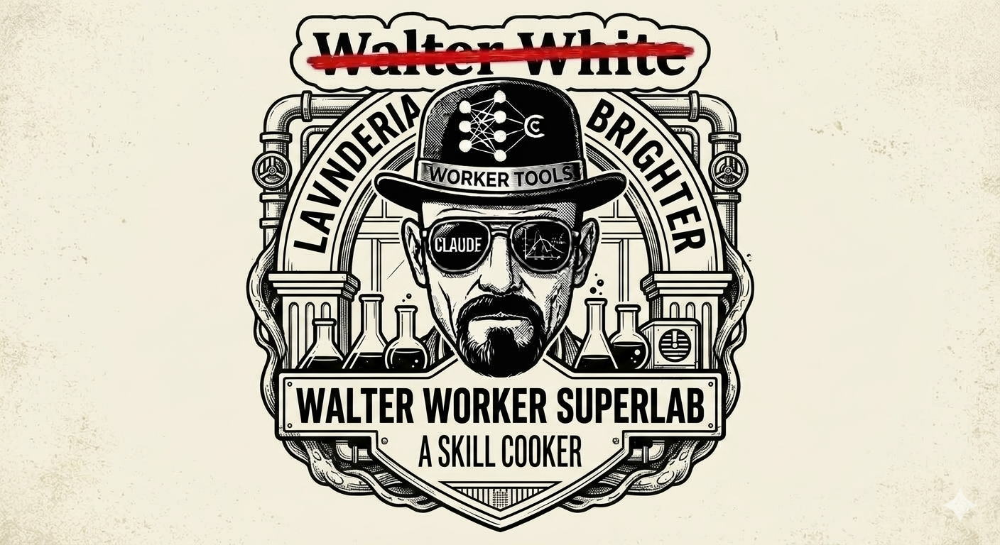

# the-super-lab



A curated collection of AI agent skills (SKILL.md format), framework-agnostic, opencode-native.

## What's a skill?

A **skill** is a self-contained directory with a `SKILL.md` file. It packages "how to do X" in a way any SKILL.md-aware agent can execute. Copy it, fork it, move it between projects — it just works.

## Available Skills

### Factory-Native Skills (`walter-worker-skills/`)

| Skill | Description |
|-------|-------------|
| [auto-tdd](walter-worker-skills/auto-tdd/) | Test-driven development with multi-agent TDD loop — red-green-refactor or full continuous loop |
| [bug](walter-worker-skills/bug/) | Debugging, bug reporting, and self-healing loop management |
| [dashboard](walter-worker-skills/dashboard/) | Analytics dashboard — view sessions, import data, manage daemon |
| [doc-organize](walter-worker-skills/doc-organize/) | Document placement, naming, INDEX.md maintenance, and merge conflict resolution |
| [doc-review](walter-worker-skills/doc-review/) | Adversarial design/spec review or work completion verification |
| [english-grammar-fix](walter-worker-skills/english-grammar-fix/) | Auto-correct minor English grammar errors in AI responses |
| [initiative](walter-worker-skills/initiative/) | Cross-project initiative management — create, edit, activate, deactivate |
| [knowledge](walter-worker-skills/knowledge/) | Extract structured knowledge from past sessions into memory cards or knowledge base |
| [memory](walter-worker-skills/memory/) | Search past session memories, knowledge cards, and code knowledge graph |
| [multi-model-team](walter-worker-skills/multi-model-team/) | Decompose large tasks into subtasks executed by specialized workers |
| [project](walter-worker-skills/project/) | Project catalog management — add, edit, remove, list, sync |
| [research](walter-worker-skills/research/) | Surface unknowns before coding; go from vague idea to concrete design |
| [skill](walter-worker-skills/skill/) | Skill lifecycle — create, edit, import, list skills in the skill-factory |
| [status](walter-worker-skills/status/) | Show current coworker config status and active initiative progress |

### Personal Skills (`personal-skills/`)

| Skill | Description |
|-------|-------------|
| [create-video-workflow](personal-skills/create-video-workflow/) | Convert research documents into audience-tailored content — presentations, videos, websites |
| [doc-protect](personal-skills/doc-protect/) | Protect sections of documents from AI edits |
| [luma-event-scout](personal-skills/luma-event-scout/) | Scout AI/tech events on Luma in the Bay Area with advanced filtering |
| [pic-to-txt](personal-skills/pic-to-txt/) | Convert a folder of screenshot images into a clean text document via OCR |
| [tmux-status-bar](personal-skills/tmux-status-bar/) | Set up tmux status bar with session, git, and initiative info |
| [transcribe-audio](personal-skills/transcribe-audio/) | Convert audio files to text transcripts using local Whisper on GPU |
| [video-production-pip-style](personal-skills/video-production-pip-style/) | Replicate the Andrei Jikh video production style with PiP citations |
| [youtube-research-pipeline](personal-skills/youtube-research-pipeline/) | Turn any topic into a complete YouTube video package with research and interactive HTML |
| [youtube-summarize](personal-skills/youtube-summarize/) | Download, transcribe, and summarize YouTube videos |

### Imported Skills (`import-skills/`)

| Skill | Description |
|-------|-------------|
| [domain-modeling](import-skills/domain-modeling/) | Build or sharpen a project's domain model with glossary and ADRs |
| [grill-with-docs](import-skills/grill-with-docs/) | Relentless interview to sharpen a plan or design with inline documentation |
| [implement](import-skills/implement/) | Implement work from a spec or tickets with TDD, typechecking, and code review |
| [prototype](import-skills/prototype/) | Build throwaway prototypes to answer design questions |
| [to-spec](import-skills/to-spec/) | Synthesize current conversation into a spec (PRD) for the issue tracker |
| [to-tickets](import-skills/to-tickets/) | Break a plan into tracer-bullet tickets with declared blocking edges |
| [wayfinder](import-skills/wayfinder/) | Plan work too large for one agent session via decision briefs on the issue tracker |

## Workflow

Skills are created and edited in this source code repo, then deployed to IDE configs:

```
Source Repo (~/project/the-super-lab/) → git push → Deployed Copy → IDE Configs
```

**Never create or edit skills directly in the deployed copy** (`~/.config/opencode/skills/the-super-lab/`) or IDE config directories (`~/.claude/commands/`, `~/.opencode/instructions/`). Changes in deployed copies are lost on next install.

## Install

```bash
git clone https://github.com/cicidi/the-super-lab.git ~/project/the-super-lab
```

To deploy skills to your IDEs, use the walter-worker install script or `coworker sync`.

## Testing

```bash
bash tests/test_skills.sh
```

Validates all skills against the-super-lab conventions: frontmatter completeness, required sections, prohibited patterns, duplicate names, and more.

## Conventions

See [CONVENTIONS.md](CONVENTIONS.md) for the project's conventions.

## License

MIT — see LICENSE file.
