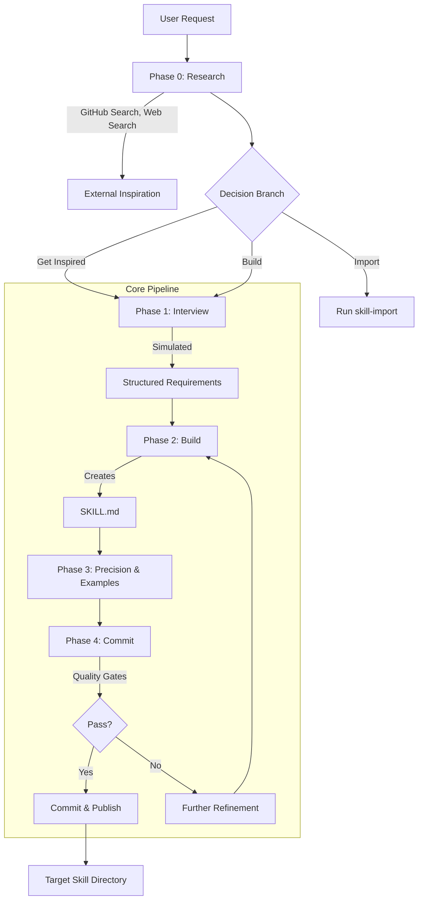

好的，根据您提供的完整开发历史记录，我为您整理并撰写了《skill-factory Design》技术设计文档。

---

# skill-factory Design

## Change Log

| 版本 | 日期 | 作者 | 变更描述 |
| :--- | :--- | :--- | :--- |
| 1.0 | 2026-07-24 | AI Agent | 基于全部开发决策，首次编写完整设计文档。 |

## 1. 高层次架构 (High-level Architecture)

`skill-factory` 是一个**元技能工厂 (Metaskill Factory)**，旨在系统化地创建、导入、编辑和管理 AI Coworker 技能。其架构核心是一个**自举 (Self-Bootstrapping)** 系统：核心技能 `skill-create` 既是工厂的工具也是工厂的产品，确保了全系统质量标准的一致性。

### 1.1 物理目录结构

项目采用三层平级目录结构，严格区分技能来源和可见性，避免语义混叠：

```
<project-root>/
├── ai-coworker-skills/    # 工厂原生、官方维护的技能。文件名匹配的 SKILL.md 前导元数据 (name) 带 `ai-coworker-` 前缀。
├── import-skills/         # 从第三方导入的技能。保留原名，不添加前缀。强制要求 META.yaml 文件以记录归因信息。
└── personal-skills/       # 用户个人私有的技能。同样带 `ai-coworker-` 前缀。该目录被 .gitignore 忽略，不纳入版本控制。
```

此结构基于用户明确的 “三个独立目录” 要求，解决了原仓库结构混乱的问题。

### 1.2 自举系统 (Bootstrapping System)

系统通过 `skill-create` 作为入口，遵循标准化的 5 阶段流程 (Phase 0 -> 1 -> 2 -> 3 -> 4) 创建任何新技能。当 `skill-edit` 检测到目标技能不存在或修改量达到 80% 时，系统会重定向回 `skill-create`，从而保证所有技能的构建源头一致。

### 1.3 安装与市场策略

- **Claude Code**: 使用原生 `extraKnownMarketplaces` 机制进行安装，通常以 Git 仓库形式提供。
- **OpenCode**: 采用 Git plugin 结合项目级别符号链接 (symlink) 的方式，以支持其非原生的 Marketplace 环境。
- **Personal Skills**: 仅通过符号链接激活，且位于 `.gitignore` 保护的目录内，保证隐私性。

## 2. 使用的设计模式 (Design Patterns Used)

项目从开发过程中提炼并固化了一套模式语言：

1.  **多智能体编排 (Multi-Agent Orchestration)**:
    - **对抗性审查 (Devil’s Advocate / Contrarian Review)**: 使用多个有状态的 Agent (如 “反对者 Con”、“支持者 Pro”、“评判者 Judge”) 进行辩论。通过 “多数投票” 机制终结无限循环。
    - **流水线审查 (Work Review)**: 采用 “收集者 (Collector) -> 审查者 (Reviewer)” 的顺序无状态 Agent 模式，实现关注点分离和清晰的执行链路。
2.  **模拟交互式访谈 (Simulated Interactive Interview)**:
    - 在 Phase 1 阶段，不进行真人对话，而是将用户需求预置为 “答案” 输入给系统，模拟访谈过程，从而在全自动化流程中生成标准化的技能需求规格。
3.  **门禁系统 (Q-Gate / Quality Gates)**:
    - 定义了 `MUST` (阻止提交) 和 `NICE` (仅警告) 两级质量门禁。这是将 “不可妥协的质量标准” 代码化并强制执行的核心模式。
4.  **元数据驱动导入 (Metadata-Driven Import)**:
    - 强制为每个 `import-skills` 下的技能创建 `META.yaml` 文件，记录 `source`、`upstream_commit`、`license` 等字段。这是实现知识溯源和开源合规性的关键模式。
5.  **标准化文件模板 (Standardized Frontmatter & Body)**:
    - 所有技能使用统一的 5 字段前导元数据 (opencode 格式) 和固定的 Body 结构 (`Overview`, `Workflow`, `Anti-Patterns`, `Quality Gates`)。导入工具会自动执行从其他格式到本模板的映射。

## 3. 技术选择与理由 (Technology Choices and Rationale)

| 技术/工具 / 决策 | 理由 |
| :--- | :--- |
| **Git** | 所有设计决策落地的唯一版本控制工具。所有代码、文档变更均可追溯。 |
| **opencode & Claude Code** | 作为 AI 编程工具的运行时环境。项目决策明确针对这两种工具的安装机制（Marketplace vs Symlink）进行了区分处理。 |
| **Playwright, curl/httpie** | 作为 `skill-review` 中的自动化测试执行器。Playwright 用于 E2E (浏览器自动化测试)，curl/httpie 用于手动或 API 测试。 |
| **SKILL.md + META.yaml** | `SKILL.md` 是技能的定义和执行文件，由 AI Agent 解析和执行。`META.yaml` 是结构化的、可由 CI 验证的元数据文件，专门用于处理第三方技能导入后的合规性问题。 |
| **Whisper (本地 GPU)** | 音频转文字 (`transcribe-audio`) 时采用，强调本地化处理与数据安全。 |
| **Webfetch (首选) / curl (备选)** | 技能 `skill-import` 中用于获取远程 `SKILL.md` 内容的统一入口，`webfetch` 能更好地融入 AI 工作流，`curl` 作为备选以防不兼容。 |

## 4. 数据流与服务拓扑 (Data Flow and Service Topology)

### 4.1 技能创建流程 (Skill Creation Flow)



### 4.2 服务拓扑 (Service Topology)

- **入口**: 通过 `opencode` 或 `Claude Code` 的 CLI 配置触发对应的 skill。
- **调度器**: 技能的 `Process` / `Workflow` 部分定义了 Agent 编排逻辑。
- **技能工厂 (Core Meta-Skills)**:
  -   **`skill-create`**: 控制器，驱动 Phase Pipeline。
  -   **`skill-edit`**: 重定向器，判断是编辑还是重导向至 `skill-create`。
  -   **`skill-import`**: 转换器 (Adapter)，负责获取外部内容并映射为内部标准格式。
- **执行技能 (Application Skills)**:
  -   **`devil-advocate`**: 多 Agent 辩论系统，输出 `discussion.md` 和 `report.md`。
  -   **`work-review`**: 双 Agent 验证系统，输出 `acceptance.md` 和 `report.md`。
  -   **其他技能**: 处理特定领域问题（如 `youtube-summarize`, `luma-event-scout` 等）。

### 4.3 数据转换：导入管线 (Data Flow: Import Pipeline)

```
External SKILL.md
      ↓ (step 2: webfetch / curl)
Mapper (skill-import)
      ↓ (Frontmatter Conversion)
      1. name → kebab-case
      2. description → starts with "Use when..."
      3. defaults: license=MIT, compatibility='opencode, claude-code'
      ↓ (Body Section Mapping)
      Philosophy → overview
      Anti-Pattern → Anti-Patterns
      Workflow → Process
      Checklist → Quality Gates
      ↓ (Remove: Changelog, Convention Notes)
      ↓ (Metadata Injection)
Internal SKILL.md + META.yaml (source, upstream_commit, etc.)
      ↓ (Output)
import-skills/<topic>/ directory
```

## 5. 关键权衡与选型原因 (Key Trade-offs and Why Specific Approaches Were Chosen)

| 权衡点 | 选择 | 理由 |
| :--- | :--- | :--- |
| **线数限制 vs 内容完整性** | 在某些情况下，优先保证内容完整性，软限制 150 行。`skill-import` 预期为 186 行。 | CONVENTIONS.md 的线数限制是 “NICE” 级门禁。对于导入或特定复杂技能，强制删除必要信息会降低技能质量。 |
| **实时真人访谈 vs 模拟访谈 vs 跳过** | 多数场景下选择 “模拟访谈 (Simulated Interview)” 或 “跳过 (Skip)”。 | 实时真人访谈会严重拖慢自动化流程。在需求由用户明确提出的情况下，跳过最为高效。模拟访谈则保证了流程的统一性。 |
| **扁平 vs 嵌套 SKILL.md 结构** | 倾向于扁平化结构 (`skills/<name>/SKILL.md`)。 | 测试表明两者均兼容。扁平化结构在路径上更简单，减少了目录深度和潜在混乱。 |
| **目录重命名 vs 前缀命名** | 保留原文件夹名，仅在前导元数据中添加 `ai-coworker-` 前缀。 | 这是用户为避免大规模 git 文件重命名操作而做出的直接指示，仅修改了元数据层的显示逻辑。 |
| **单次询问 vs 批量解决歧义** | 在 `skill-import` 中，对于歧义（如无许可协议、不明触发器）采用 “一次只问一个问题” 的策略。 | 这是用户明确要求，旨在最小化交互中断次数，同时确保关键决策点的准确性。 |